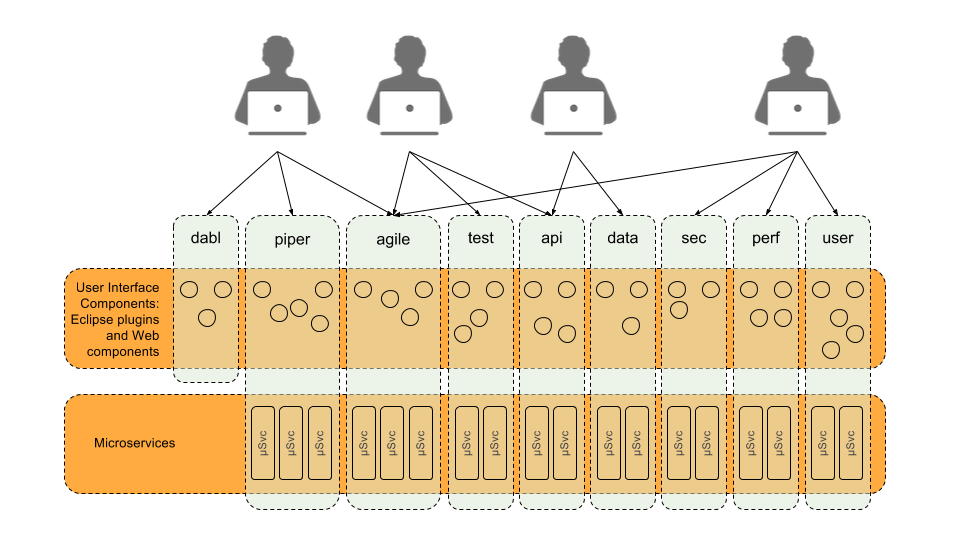

# SafeHarbor

SafeHarbor is an open source DevOps platform that integrates many of the tasks
associated with coding, testing, governing, and deploying <b><i>microservice centric
and component centric applications</i></b>.

In the spirit of microservices, SafeHarbor itself is a componentized system,
consisting of many independently usable microservices, and many independent
Web components. One can literally mix and match these, or one can use the
entire suite.

SafeHarbor supports unmet needs in today’s microservice-centric and component centric
software development/deployment lifecycle, specifically,

<ol>
<li><b>Support development of microservices.</b>
	<ol>
	<li>Current tools do not help developers to track which services they are
	working on, or which are affected by code changes or API changes.</li>
	<li>Current “Agile” tools do not help developers to plan work in terms of the
	microservices and UI components that comprise the application.</li>
	</ol>
</li>
<li><b>Support governance needs.</b>
	<ol>
	<li>Current “Agile” tools have major traceability gaps between features, tests,
	data models, and deployments.</li>
	</ol>
<li><b>Support DevOps needs.</b>
	<ol>
	<li>Current tools do not enable one to define a build/test process in a robust
	and unified way.</li>
	</ol>
</li>
<li><b>Support reliable DevOps.</b>
	<ol>
	<li>Current tools are based on scripting, schema-free data structures (JSON, YAML),
	or extensions to general purpose languages that have poor software engineering
	characteristics, and thus violate software engineering principles that are
	important for reliability and maintainability. The current tools therefore
	do not adequately support viewing infrastructure “as code”, given that
	reliable and maintainable code are essential for infrastructure.</li>
	</ol>
</li>
<li><b>Support API management.</b>
	<ol>
	<li>Current “Agile” work planning tools do not integrate API management,
	and thus developers need to separately track APIs. (See 1.i above.)</li>
	</ol>
</li>
</ol>

# Sub-Projects

The following projects are components of the SafeHarbor system. More components
will be added.

* [dabl](https://github.com/ScaledMarkets/dabl) - A build management tool: think
	of a much better make, ant, gradle, or maven. Written in Java.
* [piper](https://github.com/ScaledMarkets/piper) - A language-agnostic artifact
	repository: think of maven and Jenkins combined, but much more robust and usable.
	Built around dabl. Microservice based. Written in Java.
* [SafeHarborServer](https://github.com/ScaledMarkets/SafeHarborServer) - This is
	a container image security scanning platform. It leverages multiple image scanners
	to enable one to compose a security scanning task with a choice of scanners.
	Provides a REST service consisting of 78 REST functions. Written it Go.
	It is being refactored into two microservices: one for the user/team/org and
	access control list functionality, and one for the container scanning services.
	Uses the [redis](https://redis.io/) no-sql database.
* [safeharborcmdclient](https://github.com/ScaledMarkets/safeharborcmdclient) - Command
	line tool for using SafeHarborServer. Written in Go.
* [bddloadgen](https://github.com/ScaledMarkets/bddloadgen) - Load generation
	tool that uses a [BDD](https://www.agilealliance.org/glossary/bdd/) paradigm
	for specifying requirements as an SLA. Written in Java.

